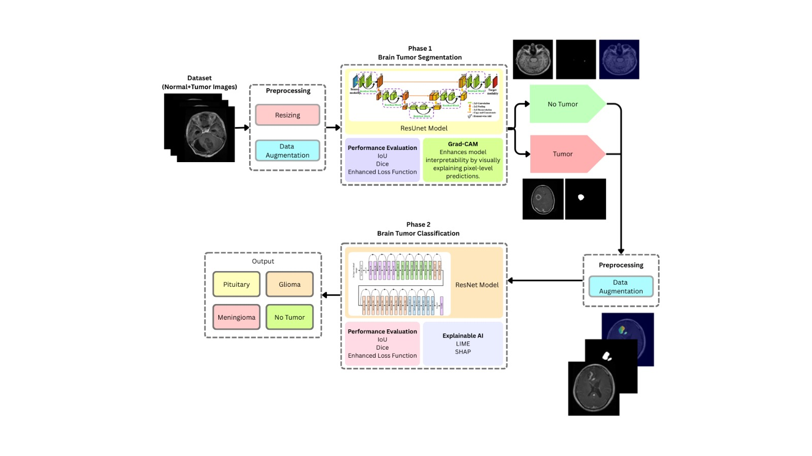

# XAI-Based Brain Tumor Detection

## 📌 Project Overview
This repository contains the implementation of a **B.Tech Final Year Project** titled  
**“XAI-Based Detection of Brain Tumors Using MRI Images.”**

The project focuses on automated **brain tumor segmentation and classification** using deep learning, with an emphasis on **Explainable Artificial Intelligence (XAI)** to improve transparency, interpretability, and clinical trust in AI-assisted diagnosis.

---

## 🎓 Academic Information
- **Degree:** Bachelor of Technology (B.Tech)  
- **Department:** Computer Science and Engineering  
- **Institute:** Heritage Institute of Technology, Kolkata  
- **University:** MAKAUT (Autonomous)  
- **Academic Year:** 2025–2026  

### 👨‍🎓 Project Members
- Anwesha Goswami  
- Jyotirmay Shrestha  
- Sayantika Bhunia  
- Sneha Lahiri  

### 👨‍🏫 Project Supervisor
**Prof. Dr. Diganta Sengupta**  
Department of Computer Science and Engineering  

---

## 🧠 Problem Statement
Manual brain tumor detection and segmentation from MRI scans is time-consuming, subjective, and prone to inter-observer variability. Although deep learning models achieve high accuracy, their **black-box nature** limits trust and adoption in clinical environments.

This project aims to develop an **accurate and interpretable AI-based framework** for brain tumor detection using MRI images.

---

## 🏗️ Methodology
The proposed system consists of the following stages:

### 1. Data Preprocessing
- MRI resizing to 256×256
- Z-score normalization
- Data augmentation (flip, rotation, noise, elastic deformation)

### 2. Tumor Segmentation
- **ResUNet-based architecture**
- Residual connections for improved gradient flow
- Hybrid loss: Binary Cross-Entropy + Dice Loss

### 3. Tumor Classification
- **ResNet-18 classifier**
- Input: segmented tumor region
- Output classes: glioma, meningioma, pituitary, no tumor

### 4. Explainability (XAI)
- **Grad-CAM** applied to segmentation and classification models
- Visual heatmaps highlighting decision-relevant regions

---

## 📊 Dataset
**BRISC (Brain Tumor Segmentation and Classification) Dataset**

- Contrast-enhanced T1-weighted MRI images
- Expert-annotated segmentation masks
- Tumor classes: glioma, meningioma, pituitary

---

## 📈 Results

### Segmentation Performance
- **Dice Score:** 0.8423  
- **IoU:** 0.7664  

### Classification Performance
- **Training Accuracy:** 99.08%  
- **Testing Accuracy:** 98.60%  

The results demonstrate accurate tumor localization, smooth boundaries, and robust classification across tumor types.

---

## 🔍 Explainable AI (XAI)
Grad-CAM is used to visualize regions of MRI scans that most influence model predictions. This improves transparency, supports clinical validation, and enhances trust in the automated system.

---
## 🚀 Future Work
- Integration of LIME and SHAP
- Custom segmentation models
- 3D MRI explainability
- Clinical validation

---

## 🛠️ Technologies Used
- Python  
- PyTorch  
- OpenCV  
- Albumentations  
- NumPy, Matplotlib  

---

